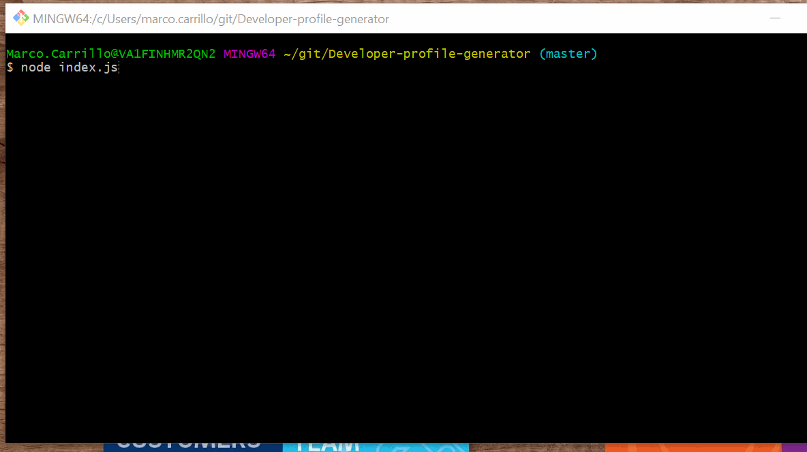

# Purpose of the application

This application generates a user profile from data stored in GitHub.  The user has the option of customizing the parameters, and the application generates two files as outputs.  The first one is an HTML and the second one is a PDF.  Both contain the user profile obtained from GitHub.

The user can decide on the background and card color, and the user to be profiled.  The PDF file will be emailed to the email address specified by the user.

## Functionality

The application will ask the user to enter the following parameters:

*  Background color (choose from the 10 most popular colors).  There is already a list of colors defined, and the user will have the ability to use the arrow up or down to select the desired color.  When the user has selected the color, pressing enter will provide the input to the application.  The entire background of the application will be formatted under this color.
*  Card color (choose from the 10 most popular colors).  User selects which color is desired similarly to the step above.  The cards with key information about user will be formatted using this color.
*  Github username:  User can enter the github username that needs to be profiled in the PDF and HTML files.  
*  E-mail address:  User enters an email address, so that the application can email the PDF file directly.

## Information returned

Information on the PDF file includes the following:

*  Picture of the Github user, as defined in Github
*  Name of the Github user, and where he/she works
*  Github user location (with Google link)
*  Link to the Github user profile
*  Link to the Github user log
*  Github user bio (summary of what they enjoy doing)
*  Number of Github user public repositories
*  Number of Github followers
*  Number of Github user that is following
*  Number of Github stars on Github user public repositories

The application generates an HTML and a PDF file.  Additionally, it sends the PDF file to the e-mail address specified by the user.

## Full demo

The following GIF shows the following actions
* User entering information to the application
* Application performing process
* Output of file and their links to other information
* E-mail sent with attachment of PDF file

